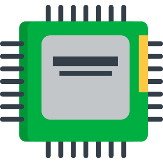

# kap-16

  

  A toy 16-bit microprocessor architecture.

---

KAP-16 is a 16-bit, little endian, [von Neumann architecture][von-neumann-architecture] microprocessor.
It runs the included LANv1 instruction set architecture (ISA).

## Contents

### Specification

KAP-16's specifications are outlined in [`spec/`](./spec).
Read the [`README.md`](./spec/README.md) for information on the architecture.
- For the full microarchitecture specification, read [`ARCH.md`](./spec/ARCH.md).
- For the full instruction set specification, read [`ISA.md`](./spec/ISA.md).
- For detailed instruction information, refer to the manual pages in [`spec/instr/`](./spec/instr).

### Assembler

The assembler is responsible for converting programs written in LANv1 assembly language into bit patterns that can be interpreted by KAP-16.
It is also capable of linking multiple object files into an executable, which can be run directly on the processor.
Since KAP-16 does not have an operating system, the executables it runs are actually a memory image.

Source code for the assembler can be found in the [`asm/`](./asm) directory.
Read the [`README.md`](./asm/README.md) for information on building and running the assembler.

### Emulator

A fully functional emulator for the KAP-16 can be found inside the [`emu/`](./emu) directory.
Read the [`README.md`](./emu/README.md) for information on building and running the emulator.

[von-neumann-architecture]: https://en.wikipedia.org/wiki/Von_Neumann_architecture
